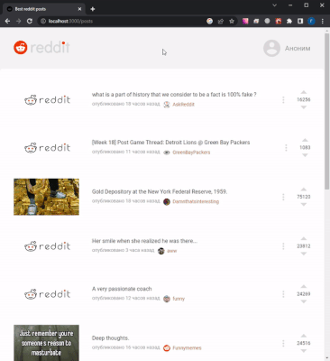

# Hi there 

Меня зовут Рэм. Я _Frontend_ разработчик, открытый к новым проектам!

👩‍💻 Мои основные инструменты: HTML5, CSS3, JS, React, TS, Webpack, Git, REST API, Redux, RTK, RTK-Query, Mobx;

🎓 Имею высшее образование, являюсь магистром в инженерной специальности, заканчивал ИРНИТУ - Институт высоких технологий.  
🎓 Окончил курсы по HTML верстке, JS и React от [Skillbox](https://skillbox.ru/) и постоянно продолжаю обучаться новому!  
🎓 Имею опыт в коммерческой разработке и не хочу останавливаться на достигнутом!  
👜 Детально ознакомиться с моим **портфолио** вы можете вот [здесь](https://github.com/rshuva1ov?tab=repositories). В портфолио выложены проекты, заказчики которых не были против выложить их код, а так же учебные и тестовые работы.

## Как связаться со мной:

**Ссылка на Telegram:** [@rshuva1ov](https://t.me/rshuva1ov/)  
**Telegram QR:** [@rshuva1ov](https://user-images.githubusercontent.com/102639623/173983628-a42a5093-2bc4-4f37-9b08-9c9e82f47a4c.png)  
**Почта:** Shuvalov.rem@mail.ru

## Стэк:

<!-- TypeScript -->

<!-- JavaScript -->

<!-- Express -->

<!-- Docker -->

<!-- HTML -->

<!-- CSS -->

<!-- React -->

<!-- Redux -->

<!-- Next -->

<!-- Sass -->

<!-- Less -->

<!-- Git -->

<!-- GitLab -->

<!-- Webpack -->

<!-- Figma -->

## [Портфолио](https://github.com/rshuva1ov?tab=repositories):

<table>
<tr>
<td width="320px">

</td>
<td>
<h3><a href="https://github.com/rshuva1ov/react-reddit" title="Открыть репозиторий">Лента лучших постов Reddit</a></h3>

Typescript, React, Redux, React Router, CRUD, IMask

Express, Mongoose, HTML, CSS, Webpack, Axios, Babel

«React Reddit» — SPA, объединяющее функции социальной сети и форума

</td>
</tr>
<tr>
<td width="320px">

</td>
<td>
<h3><a href="https://github.com/rshuva1ov/CRM" title="Открыть репозиторий">Skb CRM</a></h3>

CRUD, Model View Presenter, Patterns, Single Page Application, Routing, Pagination

NodeJS, Express, HTML, CSS, JavaScript, IMask

«Skb CRM» — сервис управления взаимоотношениями с клиентами для образовательной системы

</td>
</tr>
<td width="320px">

</td>
<td>
<h3><a href="https://github.com/rshuva1ov/Blanchard-gallery-landing" title="Открыть репозиторий">Blanchard</a></h3>

Отзывчивый дизайн, Доступность, Пиксельная точность, Производительность

HTML, CSS, JavaScript, JQuery, Яндекс карты, Swiper slider, Input mask, Just validate, Popper, Simple bar, Tippy

«Blanchard» — демонстрация галереи искусства

</td>

<tr>
<td width="320px">

</td>
<td>
<h3><a href="https://github.com/rshuva1ov/Evklid-landing" title="Открыть репозиторий">Evklid</a></h3>

Отзывчивый дизайн, Доступность, Пиксельная точность, Производительность

HTML, CSS, JavaScript, JQuery, Swiper slider, Вкладки, Gulp

«Evklid» — демонстрация проекта компании

</td>
</tr>
<tr>
<td width="320px">

</td>
<td>
<h3><a href="https://github.com/rshuva1ov/lagoona-landing" title="Открыть репозиторий">Lagoona</a></h3>

HTML, CSS

«Lagoona» — сеть отелей

</td>
</tr>
</table>
